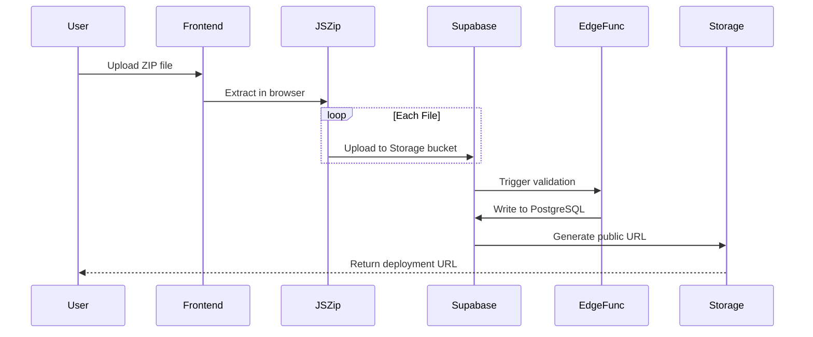

<p align="center">
  <a href="https://github.com/yourusername/deployify">
    
  </a>
  <a href="https://vitejs.dev/">
    
  </a>
  <a href="https://supabase.com/">
    
  </a>
  <a href="https://www.npmjs.com/package/deployify-cli-official">
    
  </a>
  <a href="LICENSE">
    
  </a>
</p>

<h1 align="center">Deployify</h1>

<p align="center">
  <strong>Your Self-Hosted Netlify Alternative</strong><br/>
  Deploy static sites in seconds with a single click or command.
</p>

<p align="center">
  <a href="#-what-is-deployify">About</a> •
  <a href="#-features">Features</a> •
  <a href="#-quick-start">Quick Start</a> •
  <a href="#-cli-tool">CLI Tool</a> •
  <a href="#-architecture">Architecture</a> •
  <a href="#-deployment-flow">Deployment Flow</a> •
  <a href="#-setup-guide">Setup Guide</a> •
  <a href="#-security">Security</a>
</p>

---

## 🚀 What is Deployify?

**Deployify** is a production-ready, self-hosted static site deployment platform inspired by Vercel and Netlify. Built from the ground up to give you full control over your deployment infrastructure without vendor lock-in.

Upload a ZIP file or use our CLI tool, and Deployify automatically extracts, deploys to Supabase Storage, and generates a public URL for your static site — complete with custom domain support, analytics, and team collaboration features.

### ✨ Why Deployify?

- **🔒 Full Data Ownership**: Your code, your data, your infrastructure
- **⚡ Lightning Fast**: Browser-based extraction + edge functions for instant deployments
- **🛠️ Developer First**: CLI tool available on npm for seamless CI/CD integration
- **💰 Cost Effective**: Built on Supabase's generous free tier
- **🎯 Feature Rich**: Teams, analytics, custom domains, and more out of the box

---

## 🌟 Features

### For Developers

| Feature | Description |
|---------|-------------|
| **One-Click Deploy** | Upload ZIP files directly from the dashboard |
| **CLI Tool** | Deploy from terminal with `npx deployify-cli-official` |
| **Custom Domains** | Connect your own domains with automatic SSL |
| **Team Collaboration** | Invite team members and manage permissions |
| **Analytics Dashboard** | Real-time traffic insights for all deployments |
| **API Keys** | Generate and manage API keys for automation |
| **Deploy History** | Track all deployments with rollback capability |

### For Teams

- 👥 Multi-user team workspaces
- 🔐 Role-based access control (RBAC)
- 📊 Shared analytics and deployment logs
- 🌐 Centralized domain management

### Enterprise Ready

- ✅ Row Level Security (RLS) enforced
- ✅ Google OAuth + Email/Password authentication
- ✅ Audit logs and deployment tracking
- ✅ Scalable Supabase backend architecture

---

## ⚡ Quick Start

### Prerequisites

- Node.js 18+ 
- A [Supabase](https://supabase.com) account
- npm or yarn package manager

### 1. Clone & Install

```bash
git clone https://github.com/yourusername/deployify.git
cd deployify
npm install
```

### 2. Configure Environment

Copy `.env.example` to `.env` and fill in your Supabase credentials:

```bash
cp .env.example .env
```

### 3. Set Up Supabase

Follow our [detailed setup guide](#-setup-guide) to configure:
- Authentication (Google OAuth + Email)
- Database tables
- Storage buckets
- Edge functions

### 4. Run Locally

```bash
npm run dev
```

Visit `http://localhost:5173` to see Deployify in action!

---

## 🖥️ CLI Tool

Skip the UI and deploy straight from your terminal. Our official CLI is published on npm.

### Installation

No installation needed — use with `npx`:

```bash
npx deployify-cli-official@latest
```

### Commands

| Command | Description |
|---------|-------------|
| `login <api-key>` | Authenticate with your Deployify account |
| `init "Site Name" "slug"` | Initialize a new project |
| `deploy` | Deploy current directory |
| `list` | List all your deployments |
| `logout` | Clear local credentials |

### Example Workflow

```bash
# Step 1: Login with your API key
npx deployify-cli-official login your-api-key-here

# Step 2: Initialize a new project
npx deployify-cli-official init "My Portfolio" "my-portfolio"

# Step 3: Deploy instantly
npx deployify-cli-official deploy
```

📦 **Package**: [deployify-cli-official on npm](https://www.npmjs.com/package/deployify-cli-official)

---

## 🏗️ Architecture

### Tech Stack

| Layer | Technology | Purpose |
|-------|------------|---------|
| **Frontend** | React 18 + Vite 5 | Modern, fast UI framework |
| **Backend** | Supabase | Auth, PostgreSQL, Storage |
| **Deployment** | JSZip + Edge Functions | Browser-side extraction & serverless processing |
| **CLI** | Node.js | Cross-platform command-line tool |
| **Hosting** | Vercel / Netlify | Frontend deployment |

### Project Structure

```
deployify/
├── src/                  # React application source
│   ├── components/       # Reusable UI components
│   ├── pages/           # Page components
│   │   ├── HomePage.jsx
│   │   ├── Dashboard.jsx
│   │   ├── Auth.jsx
│   │   ├── Domains.jsx
│   │   ├── Analytics.jsx
│   │   ├── Teams.jsx
│   │   ├── Deploys.jsx
│   │   ├── Settings.jsx
│   │   └── Admin.jsx
│   ├── lib/             # Utilities & helpers
│   └── App.jsx          # Main application entry
├── cli/                 # CLI tool source code
├── supabase/            # Database migrations & edge functions
├── public/              # Static assets
└── README.md            # This file
```

---

## 🔄 Deployment Flow



### Step-by-Step Process

1. **Upload**: User uploads a ZIP file via dashboard or CLI
2. **Extract**: JSZip decompresses the archive in the browser
3. **Upload**: Each file is uploaded to Supabase Storage bucket
4. **Validate**: Edge Function verifies file types and security
5. **Record**: Metadata stored in PostgreSQL with RLS policies
6. **Serve**: Public URL generated (e.g., `yoursite.deployify.app`)
7. **Optional**: Custom domain mapping with automatic SSL

---

## 📋 Setup Guide

### 1. Create Supabase Project

1. Go to [supabase.com](https://supabase.com)
2. Create a new project
3. Note your **Project URL** and **Anon Key**

### 2. Configure Authentication

#### Enable Email/Password
- Go to **Authentication → Providers**
- Enable **Email** provider

#### Enable Google OAuth
- Go to **Authentication → Providers → Google**
- Enable the provider
- Add your OAuth credentials from Google Cloud Console
- Set redirect URLs:
  - `http://localhost:5173/auth/callback` (development)
  - `https://yourdomain.com/auth/callback` (production)

### 3. Database Schema

Run the SQL migrations in `supabase/migrations/` to create:
- `sites` table
- `deployments` table
- `teams` table
- `team_members` table
- `domains` table
- `analytics` table

### 4. Storage Bucket

Create a storage bucket named `sites` with:
- Public access enabled
- File size limit: 50MB
- Allowed MIME types: `application/zip`, `text/*`, `image/*`, etc.

### 5. Edge Functions

Deploy the edge functions from `supabase/functions/`:
```bash
npx supabase functions deploy validate-deployment
npx supabase functions deploy process-upload
```

### 6. Environment Variables

Create a `.env` file in the root directory:

```bash
VITE_SUPABASE_URL=your_project_url
VITE_SUPABASE_ANON_KEY=your_anon_key
VITE_SITE_BASE_URL=https://yourdomain.com
```

---

## 🔒 Security

Deployify implements multiple layers of security:

### Authentication
- ✅ Secure JWT tokens with short expiration
- ✅ Google OAuth 2.0 with PKCE
- ✅ Email verification for new accounts
- ✅ Rate limiting on auth endpoints

### Authorization
- ✅ Row Level Security (RLS) on all database tables
- ✅ Team-based permission system
- ✅ API key scoping and rotation
- ✅ CORS policies configured

### Data Protection
- ✅ Files scanned for malicious content
- ✅ Storage bucket policies enforced
- ✅ HTTPS required for all connections
- ✅ No sensitive data in client-side logs

### Best Practices
- Regular dependency updates
- Security headers configured
- Input validation on all endpoints
- Audit logging enabled

---

## 📊 Available Pages

| Route | Description | Access |
|-------|-------------|--------|
| `/` | Marketing homepage | Public |
| `/auth` | Login / Registration | Public |
| `/dashboard` | Site management hub | Authenticated |
| `/domains` | Custom domain configuration | Authenticated |
| `/analytics` | Traffic and performance metrics | Authenticated |
| `/teams` | Team management & invitations | Authenticated |
| `/deploys` | Deployment history & logs | Authenticated |
| `/settings` | Account settings & API keys | Authenticated |
| `/admin` | Administrative dashboard | Admin only |
| `/blog` | Company blog | Public |
| `/docs` | Documentation | Public |

---

## 🧪 Testing

```bash
# Run unit tests
npm test

# Run E2E tests
npm run test:e2e

# Check code quality
npm run lint
```

---

## 🤝 Contributing

We welcome contributions! Please follow these steps:

1. Fork the repository
2. Create a feature branch (`git checkout -b feature/amazing-feature`)
3. Commit your changes (`git commit -m 'Add amazing feature'`)
4. Push to the branch (`git push origin feature/amazing-feature`)
5. Open a Pull Request

Please read our [Contributing Guidelines](CONTRIBUTING.md) for details.

---

## 📄 License

This project is licensed under the MIT License - see the [LICENSE](LICENSE) file for details.

---

## 🆘 Support

Need help? We're here for you:

- 📖 [Documentation](https://deployify.app/docs)
- 💬 [Discord Community](https://discord.gg/deployify)
- 🐛 [Issue Tracker](https://github.com/yourusername/deployify/issues)
- 📧 Email: support@deployify.app
- 🐦 Twitter: [@deployify](https://twitter.com/deployify)

---

## 🙏 Acknowledgments

- Built with [React](https://react.dev) and [Vite](https://vitejs.dev)
- Powered by [Supabase](https://supabase.com)
- CLI tool published to [npm](https://www.npmjs.com)
- Inspired by [Netlify](https://netlify.com) and [Vercel](https://vercel.com)

---

<p align="center">
  Made with ❤️ by the Deployify Team
</p>
